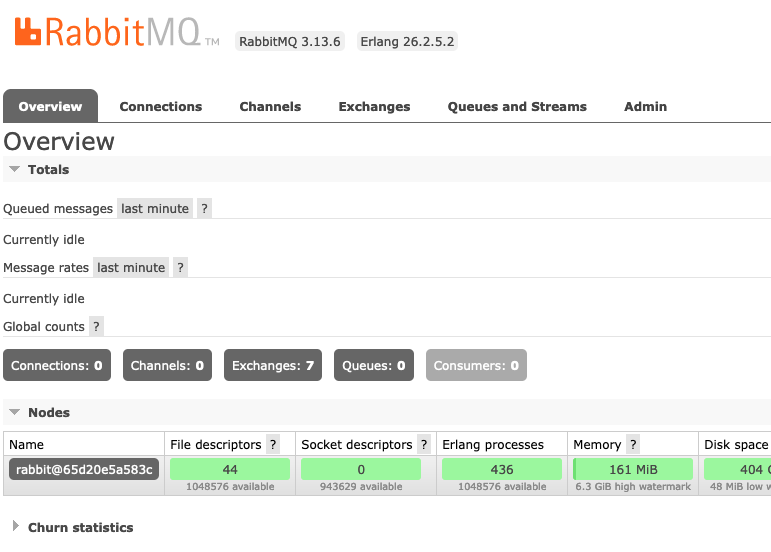

# Docker compose with redis-rabbitmq-manage

Đầu tiên, tôi sẽ để link được thao khảo tại đây [Link](https://gist.github.com/ps-jessejjohnson/cbe0df09431fb59ab3870dba5c583fa0)

Dù các bạn không biết nhưng rất cảm ơn repo/comment của các bạn, nó rất hữu ích cho tôi:

- @ps-jessejjohnson
- @ps-przemekaugustyn

Dùng trong tài liệu:

- RabbitMQ 3.13.6
- Redis: latest
- docker compose version 3.6



Với docker-compose.yml hiện tại đã có thể để cho rabbitmq và redis hoạt động.

**Step 1:** git clone resource

```
git clone https://github.com/anhitvn/docker-redis-rabbitmq.git
cd. docker-redis-rabbitmq
```

**Step 2:** Tôi đã bổ sung thêm var trong rabbitmq để dễ hơn trong tạo account cho rabbitmq.

Bạn cần thay username/password bạn muốn vào trong docker-compose > rabbitmq

```
...
    environment:
      - RABBITMQ_DEFAULT_USER=admin
      - RABBITMQ_DEFAULT_PASS=your_password
```

Tương tự trong app redis bạn cũng cần thay password redis tương ứng.

```
...
    environment:
      - REDIS_PASSWORD=your_password
```

**Một số thay đổi trong redis.conf và lưu ý quan trọng.**

Config để cho phép các network truy cập redis.

```
bind 0.0.0.0
```

Config yêu cầu nhập password (Config default)

```
protected-mode yes
```

Config password default

```
# requirepass foobared
requirepass your_password
```

Cấu hình maxmemory:

```
# maxmemory <bytes>
maxmemory 4gb
```

Điều này giới hạn Redis chỉ sử dụng tối đa 4GB RAM.

Kiểm soát giới hạn truy cập

```
# maxclients 10000
maxclients 96
```

Cấu hình maxmemory-policy:

```
# maxmemory-policy noeviction
maxmemory-policy volatile-lru
```

Chính sách này sẽ xóa các key "least recently used" (LRU) khi Redis vượt quá giới hạn maxmemory.

Tùy chọn, bạn cũng có thể cấu hình maxmemory-samples:

```
# maxmemory-samples 5 => Tôi không dùng config này trong tài liệu này
```

Điều này xác định số lượng key được mẫu khi tìm kiếm key "least recently used" (LRU). Giá trị càng cao thì độ chính xác càng tốt, nhưng hiệu suất sẽ giảm.

**Step 3:** Start container

```
docker-compose up
```

**Step 4:** Test lại redis connection với redis-cli

Máy tôi đã setup redis-cli sẵn, nếu bạn chưa setup hãy setup redis-cli mới dùng được comment này.

```
redis-cli -h [your ip] -p 16379 -a 'your_password' ping
```

Ngoài ra còn một số lưu ý khác khi cần config cải thiện đối với rabbitmq.
Khi map volume cho data của rabbitmq (`/var/lib/rabbitmq/`), sẽ có một số lỗi không mong muốn như lỗi tôi từng gặp

```
2024-07-25 16:42:53.066324+00:00 [error] <0.154.0>     reductions: 248
2024-07-25 16:42:53.066324+00:00 [error] <0.154.0>   neighbours:
2024-07-25 16:42:53.066324+00:00 [error] <0.154.0> 
2024-07-25 16:42:53.070181+00:00 [notice] <0.44.0> Application rabbitmq_prelaunch exited with reason: {{shutdown,{failed_to_start_child,prelaunch,{badmatch,{error,{{shutdown,{failed_to_start_child,auth,{"Cookie file /var/lib/rabbitmq/.erlang.cookie must be accessible by owner only",[{auth,init_no_setcookie,0,[{file,"auth.erl"},{line,313}]},{auth,init,1,[{file,"auth.erl"},{line,165}]},{gen_server,init_it,2,[{file,"gen_server.erl"},{line,980}]},{gen_server,init_it,6,[{file,"gen_server.erl"},{line,935}]},{proc_lib,init_p_do_apply,3,[{file,"proc_lib.erl"},{line,241}]}]}}},{child,undefined,net_sup_dynamic,{erl_distribution,start_link,[#{name => rabbit_prelaunch_20@localhost,supervisor => net_sup_dynamic,net_tickintensity => 4,net_ticktime => 60,name_domain => shortnames,clean_halt => false}]},permanent,false,1000,supervisor,[erl_distribution]}}}}}},{rabbit_prelaunch_app,start,[normal,[]]}}
Runtime terminating during boot (terminating)

Crash dump is being written to: erl_crash.dump...[os_mon] memory supervisor port (memsup): Erlang has closed
[os_mon] cpu supervisor port (cpu_sup): Erlang has closed
```

Đây là lỗi khi RabbitMQ khởi động và nó liên quan đến việc khởi tạo module 'auth'.

Để xử lý lỗi này tôi cần phải set lại permision cho file cookie của RabbitMQ `/var/lib/rabbitmq/.erlang.cookie`

Set xong thì chỉ cần restart lại docker-compose là được.

Chúc bạn thành công.
